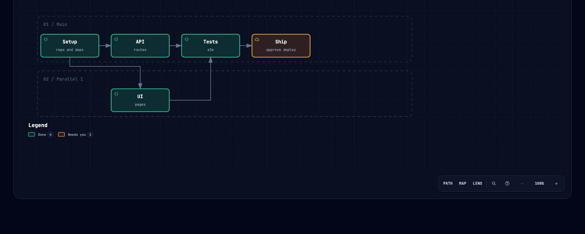

# build-map

A live picture of a build while it runs. Each part of the build is a box, arrows show what waits on what, and the colours change as work moves: done, building now, waiting, blocked, needs you. Open one page in a browser and it redraws itself every 15 seconds.



I use it while Claude Code runs a multi-agent build: the orchestrator calls `build-map set` every time a part changes state, and I watch the page instead of reading logs.

It renders through [archify](https://github.com/tt-a1i/archify) (MIT), which lays out the diagram and validates it: no crossing arrows, labels that fit.

## Needs

- Python 3
- Node.js 18+
- archify, installed as a Claude Code skill:
  ```bash
  git clone https://github.com/tt-a1i/archify ~/.claude/skills/archify
  node ~/.claude/skills/archify/bin/archify.mjs doctor
  ```
  Somewhere else? Set `ARCHIFY=/path/to/archify/bin/archify.mjs`.

## Try it

```bash
git clone https://github.com/MrScratch99/build-map && cd build-map
./demo.sh
```

Open `demo-out/live.html` while it runs. Five parts go from waiting to done over about 20 seconds.

## Use it

**1. Draw the build once.** One `--node` per part (`id:label:note`), one `--after` per dependency. Columns come from dependency depth; parts that can run at the same time get their own lanes.

```bash
./build-map init ./map --title "Checkout rewrite" \
  --node "db:Schema:migrations" \
  --node "api:API:routes" \
  --node "ui:UI:pages" \
  --node "e2e:E2E tests" \
  --after "api:db" --after "ui:db" --after "e2e:api,ui"
```

**2. Update it as work moves.** One command sets the states and redraws, so the picture cannot drift from reality.

```bash
./build-map set ./map db=done api=running ui=running
./build-map set ./map api=blocked:"type error" ui=done
./build-map set ./map e2e=human:"approve deploy"
```

States: `waiting`, `running`, `done`, `blocked`, `human`. Text after the colon shows under the box name.

**3. Watch it.** Open `./map/live.html`.

A hand-written archify workflow JSON also works: `./build-map my-map.json ./map/status.json ./map`.

## Idle warning

When more parts are waiting than running, the subtitle says so and names them. That usually means a dependency arrow that isn't real, and work that could run in parallel is sitting.

## With Claude Code

Put this in your orchestrator's instructions (or CLAUDE.md):

> Before dispatching anything, run `build-map init` with every node and its dependencies. After every state change on the board, run `build-map set` in the same step. A node is `running` only while an agent is actually working on it.

That last rule matters: a map that shows six boxes building while one agent works is worse than no map.

## License

MIT
